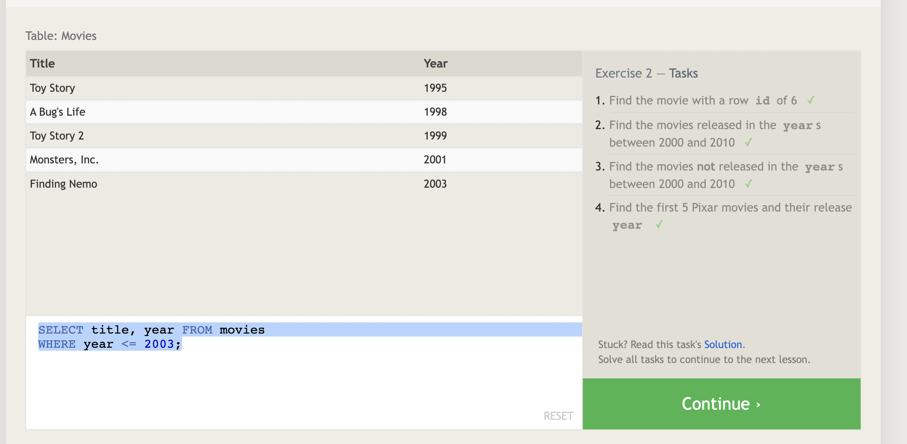

# SQL-LESSON 1

# SQL-LESSON 2

# SQL-LESSON 3

# SQL-LESSON 4

# SQL-LESSON 5

# SQL-LESSON 6

# SQL-LESSON 13

# SQL-LESSON 14

# SQL-LESSON 15

# SQL-LESSON 16

# SQL-LESSON 17

# SQL-LESSON 18

## Summary of Exercise

### The whole exercise was about working with tables and picking the right information with certain key words such as WHERE, DISTINCT, LIKE etc. Lesson 1 was the easiest of all just some basic commands to find the title and director basically SELECT queries. Lesson 2 got a bit more complex by including rows and ids using queries with constraints. Lesson three continued that path and add strings to it. But By the time I got to lesson 13 I really had to use the solution button and reverse engineer those challenges.Basically a A relational database is a collection of information. It's job is to organize data in one or more tables of columns and rows. That way you can easily see the information you are looking for and separate it from the rest.

